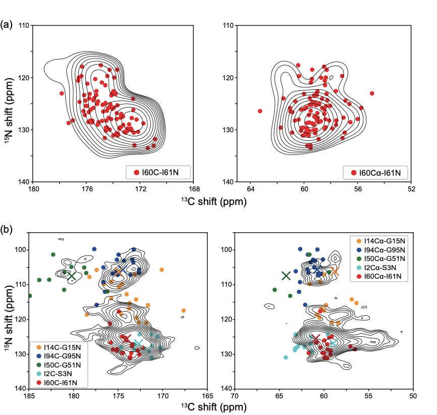

# DHFR_MD_QMMM

This repo contains the code and files for the paper titled *Predicted and Experimental NMR Chemical Shifts at Variable Temperatures: The Effect of Protein Conformational Dynamics*. The molecular dynamics trajectory can be found at [here](https://www.dropbox.com/sh/oeh8vczn4689mx3/AABoW2OhKz--cKl6iIzvho3ra?dl=0).



## Prerequisite
* [Anaconda](https://docs.conda.io/projects/conda/en/latest/user-guide/install/)
* [Schrödinger Suite](https://www.schrodinger.com/downloads/releases)
* [AFNMR](https://github.com/dacase/afnmr)
* [AmberTools](https://ambermd.org/AmberTools.php)
* [ORCA](https://www.orcasoftware.de/tutorials_orca/)


## Minimal example

We provide here an example to run a QM/MM calculation using ORCA for MET1 in the first snapshot of the MD trajectory (schrodinger_md_0.pdb).

### Install
Install [Anaconda](https://docs.conda.io/projects/conda/en/latest/user-guide/install/), [AFNMR](https://github.com/dacase/afnmr), and [ORCA](https://www.orcasoftware.de/tutorials_orca/).

Clone the repository and setup the conda environment

```
git clone git@github.com:zlcrrrr/DHFR_MD_QMMM.git
conda env create -n AmberTools22 --file AmberTools22.yml
```
Then run AFNMR and QM/MM calculations. 
```
cd ./examples
./run_example.sh
```
The calculated chemical shifts are in results.txt (shown below). Columns are residue index, atom name, residue name, chemical shift, delta, eta, xx, yy, zz, respectively.

```
1	N	MET	  26.962	  13.053	   0.282	 200.985	 218.722	 222.408
1	H1	MET	   4.906	 -14.839	   0.075	  20.321	  21.428	  43.133
1	H2	MET	   5.160	 -13.178	   0.141	  20.522	  22.378	  41.218
1	H3	MET	   4.913	 -11.649	   0.044	  22.208	  22.717	  39.936
1	CA	MET	  57.680	  19.816	   0.690	 112.304	 135.191	 148.864
1	HA	MET	   3.954	   2.103	   0.943	  27.143	  29.305	  31.289
1	CB	MET	  31.892	  25.632	   0.181	 132.276	 168.403	 173.044
1	HB2	MET	   2.319	   6.280	   0.359	  24.601	  32.894	  35.147
1	HB3	MET	   2.331	  -6.124	   0.734	  25.559	  30.056	  36.993
1	CG	MET	  27.314	 -19.298	   0.903	 144.127	 161.548	 181.784
1	HG2	MET	   2.205	  -6.771	   0.866	  24.680	  30.541	  37.766
1	HG3	MET	   2.289	   6.861	   0.925	  24.050	  31.168	  37.514
1	CE	MET	  20.212	 -25.434	   0.515	 150.322	 163.421	 195.022
1	HE1	MET	   1.603	 -10.060	   0.321	  24.950	  28.184	  41.657
1	HE2	MET	   2.139	  -7.020	   0.977	  24.122	  30.979	  38.081
1	HE3	MET	   1.286	  -9.262	   0.233	  26.202	  28.364	  41.176

```


## Reproduce our MD/QM/MM results

### MD simulation
The DHFR initial structure we used for our MD simulations is in ./initial_structure/DHFR.pdb. The details to prepare the initial structure, as well as setup and run a MD simulation are in the paper. We provide the resulting 1μs MD trajectory [here](https://www.dropbox.com/sh/oeh8vczn4689mx3/AABoW2OhKz--cKl6iIzvho3ra?dl=0) (~2.5 GB).


### QM/MM calculations
Note: we performed all the AFNMR and QMMM calculations described in the paper on a HPC cluster using Slurm. The scripts provided in the respository are just examples. You may need to tweak our scripts to fit your computing environment.

Install [Schrödinger Suite](https://www.schrodinger.com/downloads/releases). Download the [MD trajectory](https://www.dropbox.com/sh/oeh8vczn4689mx3/AABoW2OhKz--cKl6iIzvho3ra?dl=0), and copy the MD trajectory files to ./afnmr. 

Then extract the snapshots
```
./trj2pdb.sh
```

Then submit minimization and AFNMR jobs to Slurm. 
```
cd afnmr
./run_workflow.sh
```

After the minimization and AFNMR jobs are done, run
```
./prepare_scripts.sh # prepare QM/MM calculation scripts
```
and 
```
./submit_all.sh # submit QM/MM calculation jobs to Slurm
```

Finally, extract the calculated chemical shifts. Results are in ./results/
```
./extract_shifts.sh
```


# Organization of this directory
```
.
├── AmberTools22.yml
├── README.md
├── afnmr
│   ├── extract_shifts.sh
│   ├── logs
│   ├── prepare_scripts.sh
│   ├── run_afnmr.sh
│   ├── run_minimization.sh
│   ├── run_workflow.sh
│   └── submit_all.sh
├── examples
│   ├── run_example.sh
│   └── schrodinger_md_0.pdb
├── figures
│   └── fig.png
├── initial_structure
│   └── DHFR.pdb
├── lib
│   ├── SO4.frcmod
│   ├── SO4.lib
│   ├── TMP.frcmod
│   └── TMP.lib
├── scripts
│   └── getshifts-orca-old
└── trj2pdb.sh
```